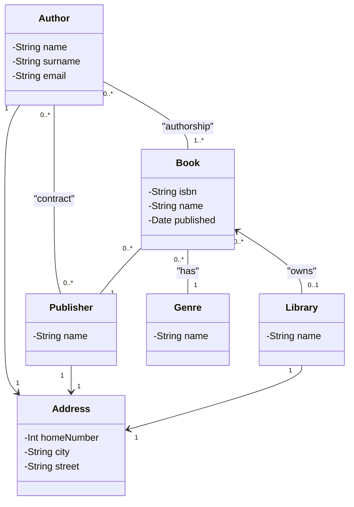

# library problem

## Keywords
- Library
    - max 5 books of same kind
- Book
    - (can have more then one author)
    - only one Publisher 
- Author
    - contract (/w Publisher)
    - (writes books for publishers)
- Publisher

