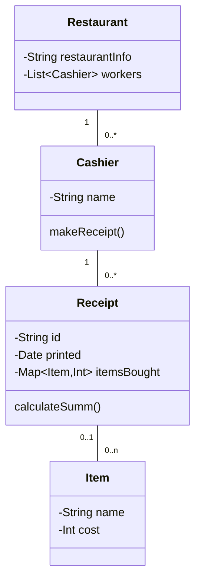

# Shebek's design
```Mermaid
erDiagram
    SALES_LINEITEM {
        int quantity
    }
    SALE {
        datetime date
        datetime time
    }
    PAYMENT {
        float amount
    }
    CUSTOMER {}
    PRODUCT_CATALOG {}
    PRODUCT_SPECIFICATION {
        string description
        float price
        string itemID
    }
    STORE {
        string address
        string name
    }
    ITEM {}
    POS {}
    MANAGER {}
    CASHIER {}

    SALES_LINEITEM ||--o| SALE : "Contained-in"
    SALE ||--|{ SALES_LINEITEM : "1..*"
    SALE ||--|{ PAYMENT : "Paid-by"
    SALE ||--|{ CUSTOMER : "Initiated-by"
    SALE ||--o| POS : "Captured-on"
    SALE ||--|{ STORE : "Logs-completed"
    STORE ||--|{ PRODUCT_CATALOG : "Used-by"
    STORE ||--|{ ITEM : "Stocks"
    STORE ||--|{ POS : "Houses"
    POS ||--|| MANAGER : "Started-by"
    PRODUCT_CATALOG ||--o| PRODUCT_SPECIFICATION : "Contains"
    PRODUCT_SPECIFICATION ||--o| ITEM : "Describes"
    ITEM ||--|{ PRODUCT_SPECIFICATION : "1..*"
    POS ||--|| CASHIER : "Records-sales-on"

```
