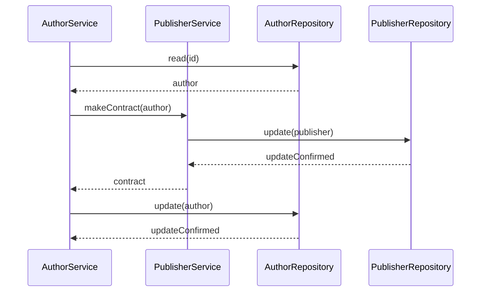
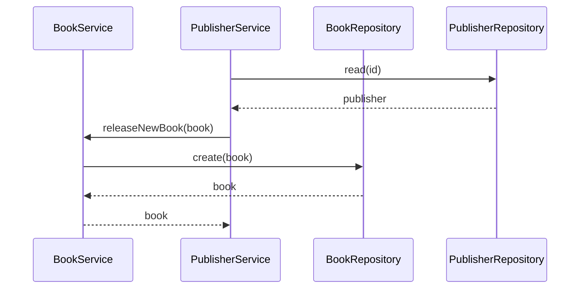
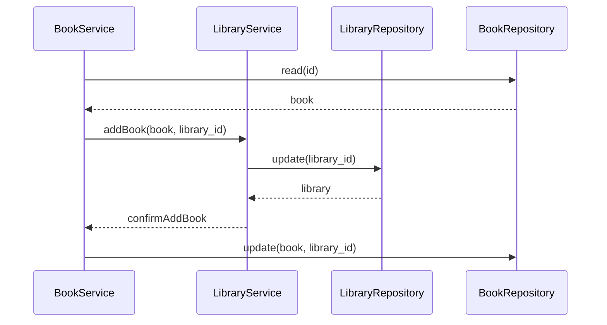

# Sequence diagrams

## Author makes a contract with a publisher

```mermaid
sequenceDiagram
    participant A as AuthorService
    participant P as PublisherService
    participant AR as AuthorRepository
    participant PR as PublisherRepository
    
    A->>AR: read(id)
    AR-->>A: author
    
    A->>P: makeContract(author)
    P->>PR: update(publisher)
    PR-->>P: updateConfirmed
    
    P -->> A: contract
    A ->> AR: update(author)
    AR -->> A: updateConfirmed
```

## Publisher releases new book

```mermaid
sequenceDiagram
    participant B as BookService
    participant P as PublisherService
    participant BR as BookRepository
    participant PR as PublisherRepository
    
    P->>PR: read(id)
    PR-->>P: publisher
    
    P->>B: releaseNewBook(book)
    B->>BR: create(book)
    BR-->>B: book
    B-->>P: book
```

## Adding book to a library

```mermaid
sequenceDiagram
    participant B as BookService
    participant L as LibraryService
    participant LR as LibraryRepository
    participant BR as BookRepository
    
    B->>BR: read(id)
    BR-->>B: book
    
    B->>L: addBook(book, library_id)
    L->>LR: update(library_id)
    LR-->>L: library
    L-->>B: confirmAddBook
    B->>BR: update(book, library_id)
```